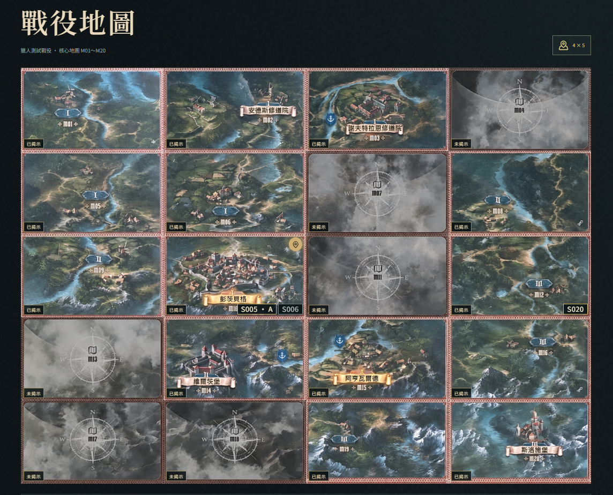
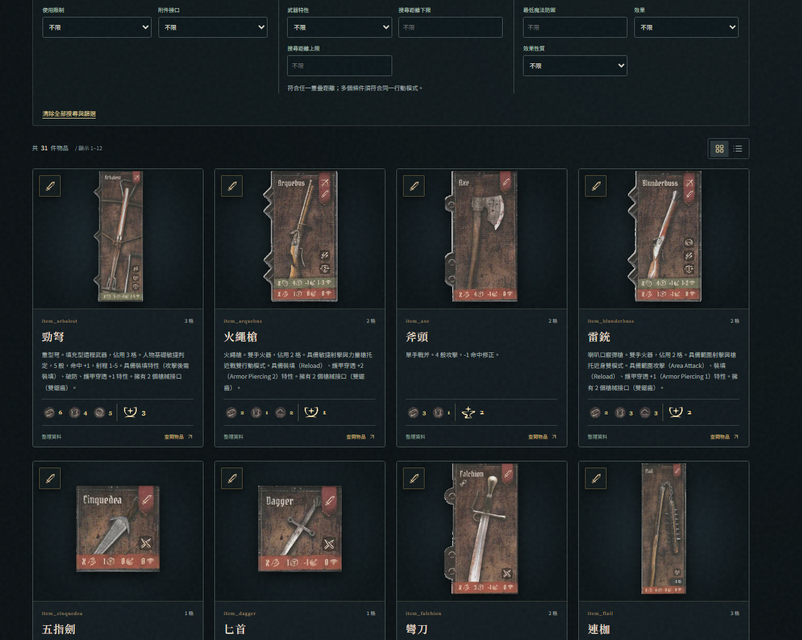
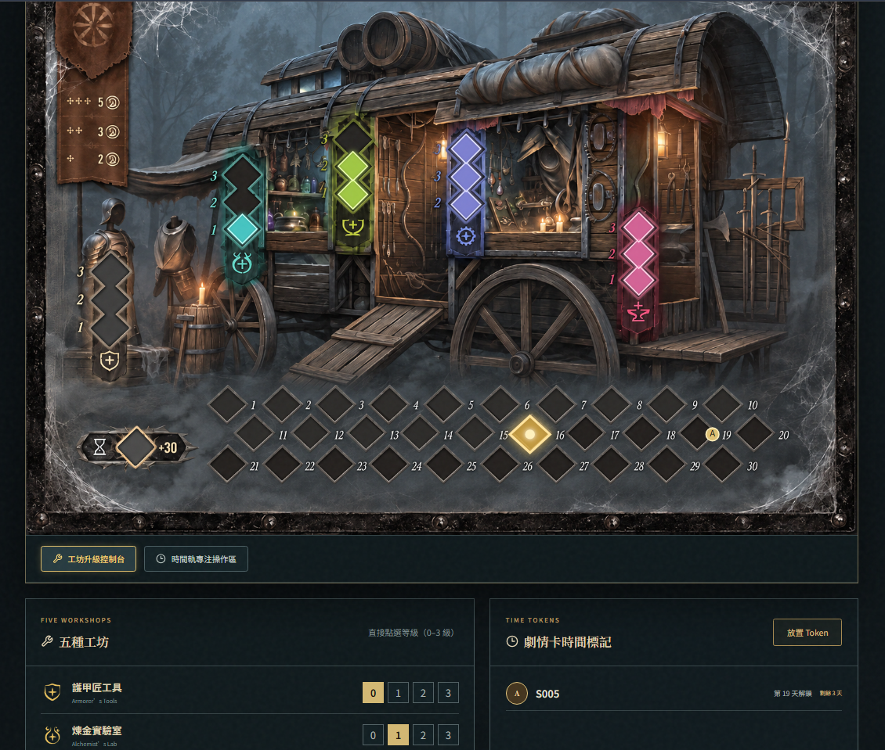
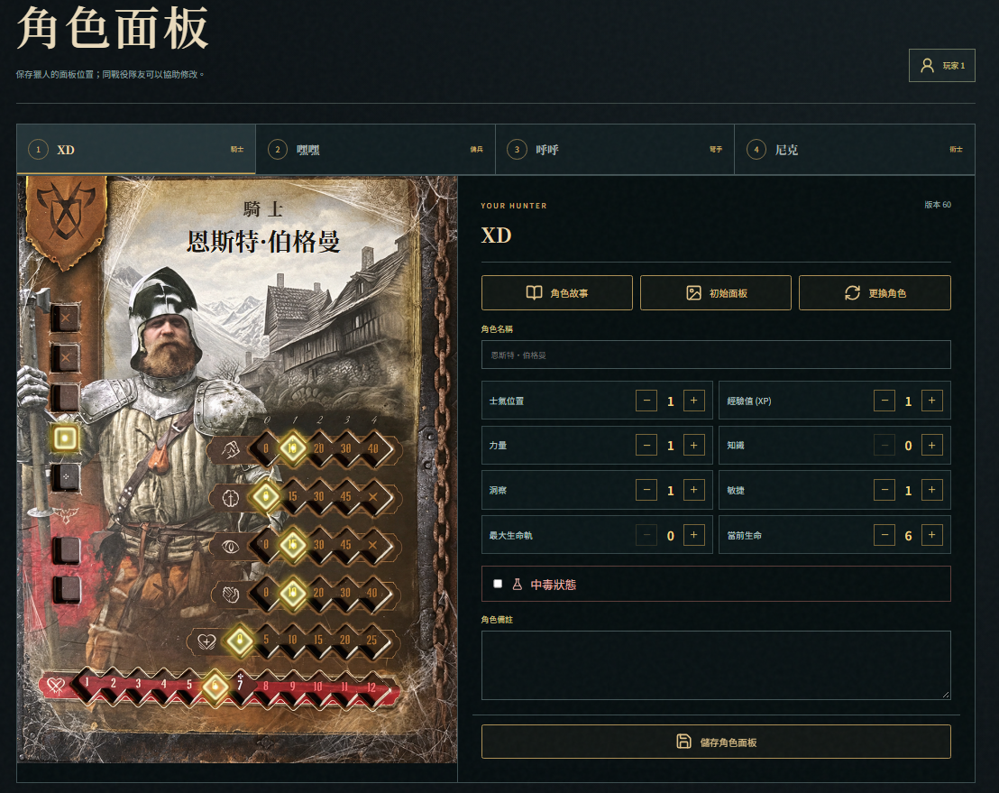
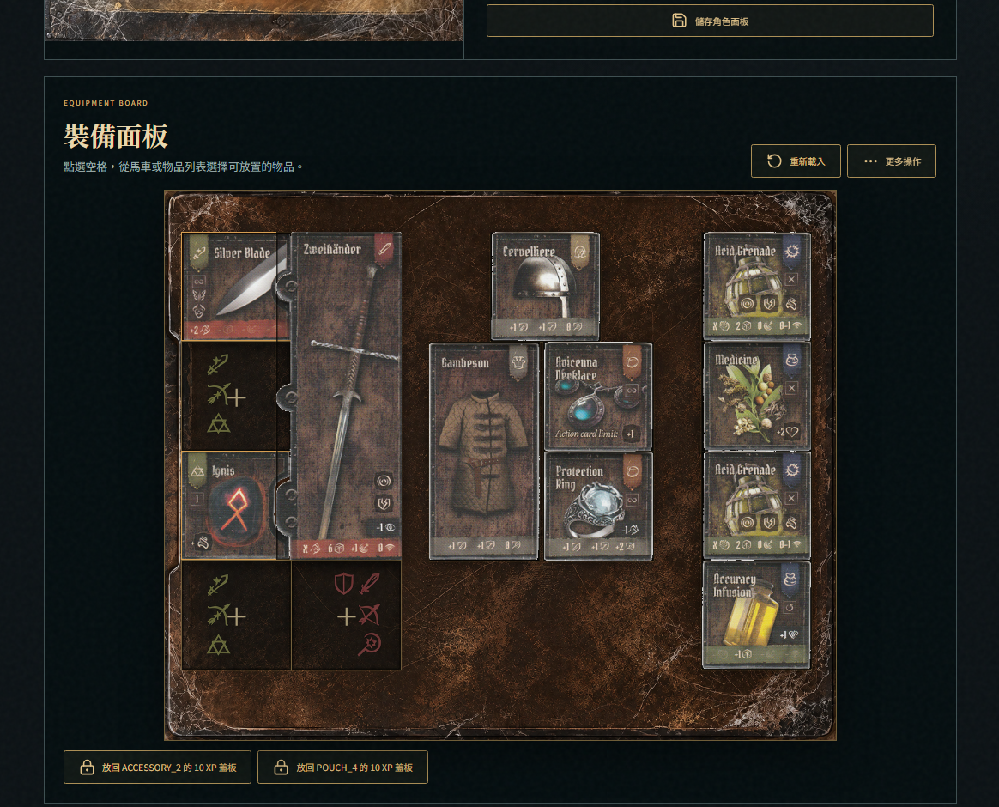
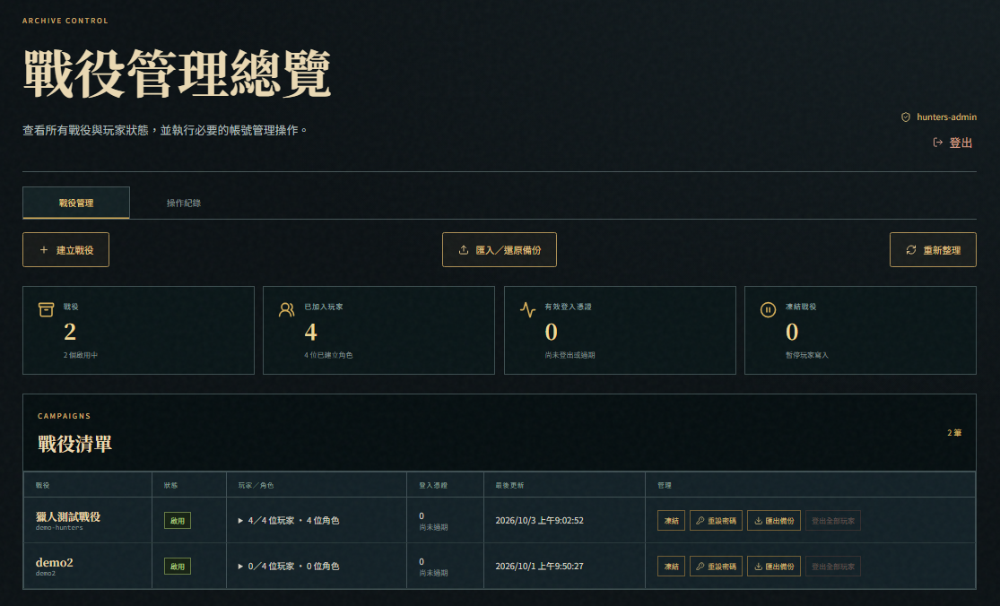
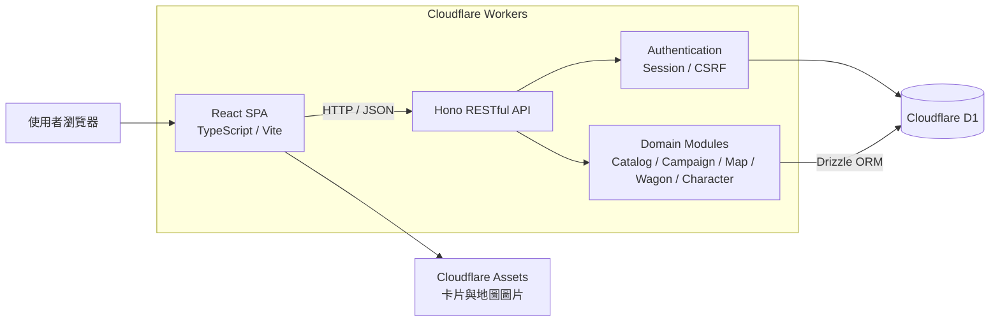

# The Hunters A.D. 1492 Wiki

以 React、TypeScript、Hono 與 Cloudflare D1 開發的《The Hunters A.D. 1492》非官方繁體中文物品圖鑑與多人戰役管理系統。

本專案將分散於卡片與規則資料中的裝備、合成及戰役資訊數位化，提供條件搜尋、角色裝備、馬車倉庫、世界地圖與多人戰役狀態管理，協助玩家減少翻找卡片及人工記錄的時間，並支援桌面與手機版操作。

- **線上展示**：[the-hunters-ad-1492.boardgame-wiki.workers.dev](https://the-hunters-ad-1492.boardgame-wiki.workers.dev/)
- **測試帳號**：`demo-hunters`
- **測試密碼**：`hunters1492`
- **開發期間**：2026/09/23～2026/10/07

> 本專案由玩家整理，不代表官方翻譯或規則。物品內容仍應以遊戲原始資料與規則書為準。

## 專案畫面

### 戰役世界地圖

[](docs/screenshots/campaign-map-review.png)

| 物品圖鑑與條件篩選 | 馬車與共用庫存管理 |
| --- | --- |
| [](docs/screenshots/item-catalog-review.png) | [](docs/screenshots/wagon-management-review.png) |

| 角色裝備配置 | 裝備面板 |
| --- | --- |
| [](docs/screenshots/character-loadout-review.png) | [](docs/screenshots/equipment-board-review.png) |

### 管理者後台

[](docs/screenshots/admin-dashboard-review.png)

## 功能

### 1. 裝備與物品圖鑑 (Equipment Compendium)
- 瀏覽目前收錄的裝備與物品（涵蓋武器、防具、頭盔、飾品、附件、藥劑與材料等）
- 依名稱、資料代碼、效果文字搜尋，或依格數、攻擊類型、屬性、效果及接口篩選
- 查看去背卡片縮圖、行動面板、數值加成、效果說明與工坊合成需求
- 搜尋及篩選條件完整保留在網址中，支援直接分享

### 2. 戰役管理系統 (Campaign System)
- **多玩家席位與權限**：支援 1~4 人跑團憑證登入，具備樂觀鎖（Optimistic Locking）版本防衝突控制
- **馬車營地系統 (Wagon Management)**：
  - 追蹤戰役天數（Elapsed Days）與推進歷程
  - 5 大工坊升級槽位（鐵匠、製弓、煉金、工藝、防具）等級與升級紀錄
  - 馬車共用裝備倉庫與材料庫存管理
  - 時間標記（Time Token A/B/C/D）排程放置與到期提醒
- **大世界戰役地圖 (Campaign World Map)**：
  - 完整 20 張地圖板塊（M01 ~ M20）網格連續地圖與雙面切換（正面探險地圖 / 背面純色底圖）
  - 移動指示物（Hunters Move Token）放置與獵人隊伍當前位置標記
  - 支援地圖卡片放置、狀態切換（未完成／進行中／已解決）、加入城鎮牌庫標記
  - **卡片即時備註**：直接在地圖抽屜中針對放置卡片新增與修改備註（notes）
  - **到期時間標記指示**：在地圖卡片上直接顯示已綁定的 Time Token 與預計解鎖天數
  - **地點卡（Location Cards）**：支援地點揭示、資源備註與探索歷程紀錄
  - **沉浸式體驗與行動端優化**：具備 3D 卡牌翻轉動效（Card Flip）、卡號快速搜尋、地圖全景檢視與手機 Safe-area 底部操作列

> 目前資料來源包含裝備圖鑑資料集、工坊合成資料以及戰役地圖母版。物品內容仍以遊戲原始實體配件與規則書為準。

## 專案目錄結構

```text
the-hunters-ad-1492/
├─ src/                         # React 前端程式
│  ├─ components/              # 共用 UI 與領域元件
│  ├─ lib/                     # API client、共用 hooks 與樂觀更新邏輯
│  ├─ pages/                   # 圖鑑、登入、戰役、地圖與管理頁面
│  ├─ App.tsx                  # 前端路由與應用程式入口
│  ├─ main.tsx                 # React 掛載入口
│  └─ styles.css               # 全站樣式
│
├─ server/                      # Hono 後端 API
│  ├─ db/
│  │  ├─ schema/               # Drizzle 資料表定義
│  │  ├─ batch.ts              # D1 批次操作
│  │  └─ optimistic.ts         # 樂觀鎖與版本衝突處理
│  ├─ http/                    # JSON 回應與衝突錯誤處理
│  ├─ index.ts                 # Worker 入口與路由註冊
│  ├─ auth.ts                  # 玩家登入、Session 與權限驗證
│  ├─ catalog.ts               # 物品圖鑑與篩選查詢
│  ├─ characters.ts            # 戰役角色資料
│  ├─ characterLoadout.ts      # 角色裝備配置查詢
│  ├─ map.ts                   # 戰役地圖與卡片狀態
│  ├─ wagon.ts                 # 馬車、庫存及時間標記
│  └─ admin.ts                 # 管理者登入與戰役管理
│
├─ shared/                      # 前後端共用型別、常數及資料模板
├─ data/                        # 裝備、材料及合成來源資料
├─ migrations/                  # Cloudflare D1 schema 增量遷移
├─ seeds/                       # 初始資料與資料庫匯入 SQL
├─ public/                      # 卡片、地圖與其他靜態資源
├─ tests/
│  ├─ fixtures/                # 測試資料
│  └─ visual/                  # Playwright 視覺與行動版測試
├─ docs/                        # 架構、資料庫與功能設計文件
├─ scripts/                     # 資料轉換、匯入、圖片處理與部署腳本
├─ wrangler.jsonc               # Cloudflare Workers／D1 設定
├─ package.json                 # 專案指令與套件設定
└─ README.md
```

## 系統架構



### 架構說明

- 前端採用 React 19、TypeScript 與 Vite 建立 SPA，負責物品查詢、戰役地圖、馬車倉庫及角色裝備等互動介面。
- 前端統一透過 HTTP／JSON 呼叫 Hono RESTful API，不直接存取資料庫。
- 後端依領域拆分物品目錄、戰役、地圖、馬車、角色及裝備等 API 模組。
- 使用 Drizzle ORM 存取 Cloudflare D1，並透過 migrations 管理資料結構演進。
- 使用 Session、CSRF 防護與戰役權限檢查保護資料異動操作。
- 多人編輯採用版本檢查與 Optimistic Locking，避免不同玩家的更新互相覆蓋。
- 前端、API 與靜態資源部署於 Cloudflare Workers／Assets。

### 技術棧

- React 19、TypeScript、Vite
- Hono API（Worker 邊緣運行）
- Drizzle ORM（型別安全的 Cloudflare D1 資料庫操作與 Schema 定義）
- Cloudflare D1（關聯式 SQLite 邊緣資料庫）
- Cloudflare Workers（全球部署，結合 Assets 靜態託管）
- Playwright（視覺回歸與行動裝置適配測試）
- 已部署至 [Cloudflare Workers](https://the-hunters-ad-1492.boardgame-wiki.workers.dev)

前端資料嚴格透過 `/api` 讀取，資料存取全面由 Drizzle ORM 處理，重要操作均採 D1 batch 原子批次交易防護。

```text
React (SPA) → /api → Hono Router → Drizzle ORM → Cloudflare D1 (hunters-db)
```

詳細設計請參閱 [系統架構](docs/architecture.md) 與 [資料庫設計](docs/database-review.md)。

## 主要模組

| 模組 | 功能 |
| --- | --- |
| Item Catalog | 物品搜尋、條件篩選、詳細資料與合成需求 |
| Campaign | 戰役建立、玩家登入及戰役狀態管理 |
| Character | 角色資料、裝備配置與持有物品管理 |
| Wagon | 共用庫存、工坊升級、經過天數及時間標記 |
| World Map | 地圖拼接、隊伍位置、地圖卡片與翻面狀態 |
| Authentication | 玩家 Session、CSRF 防護與存取控制 |
| Data Pipeline | 來源資料驗證、JSON／SQL 產生與種子資料匯入 |

## 開發流程

本專案採用 **AI-assisted Spec-driven Development**：

1. 先與 AI Agent 討論需求、使用情境與功能邊界。
2. 將確認後的內容整理為 implementation plan。
3. 依功能相依關係拆分為數個開發階段及可驗證的小任務。
4. 每完成一段功能後執行 typecheck、build、測試與人工操作驗證。
5. 確認結果符合預期後，再進入下一階段開發。
6. AI 產生的程式碼由開發者負責審查、修改及最終驗證。

## 本機執行

需求：Node.js 22.12 以上及 npm。

```bash
git clone https://github.com/john123881/the-hunters-ad-1492-wiki.git
cd the-hunters-ad-1492-wiki
npm ci
npm run data:seed
npm run db:setup
npm run dev
```

開啟 <http://localhost:5173>。

`npm run db:setup` 會自動執行 D1 migration 並匯入裝備目錄。

## 常用指令

| 指令 | 用途 |
| --- | --- |
| `npm run dev` | 啟動 React、Hono 與本機 D1 開發伺服器 |
| `npm run typecheck` | 檢查前後端 TypeScript 型別 |
| `npm run build` | 型別檢查並建立正式版產物 |
| `npm run preview` | 在本機預覽正式建置結果與 API |
| `npm run data:seed` | 驗證來源 JSON 並產生 D1 seed SQL |
| `npm run db:migrate` | 套用本機 D1 migrations |
| `npm run db:setup` | 套用 migrations 並重設本機基礎資料 |
| `npm run test:visual` | 執行 Playwright 行動端視覺回歸測試 |
| `npm run deploy:prod` | 一鍵完成型別檢查、打包、遠端遷移與部署至 Cloudflare |

## 專案狀態

本專案現已完成：
1. **物品圖鑑與合成系統（MVP）**
2. **馬車營地與天數推進系統**
3. **M01~M20 大世界戰役地圖與卡片標記系統**
4. **角色面板與裝備配置系統（Hero & Equipment Boards）**
5. **管理者登入、戰役管理、備份與操作紀錄**

