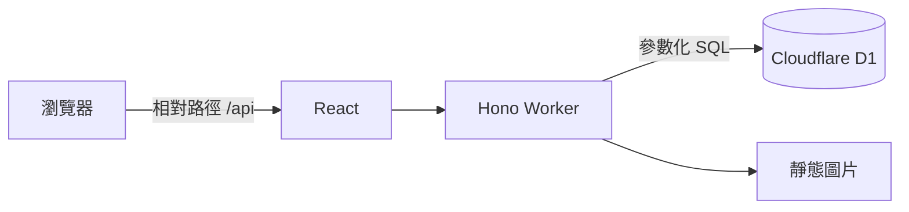

# 系統架構

本文件記錄目前已實作的架構。產品現階段只提供物品圖鑑，不包含角色行動卡與合成查詢。

## 請求流程



Vite 與 Cloudflare plugin 在開發環境同時提供 React 熱更新、Worker runtime 與本機 D1。前端沒有物品固定陣列；列表、目錄資訊與詳情都從 Hono API 取得。

## 程式分層

| 路徑 | 責任 |
| --- | --- |
| `src/` | 頁面、互動、URL 查詢狀態及響應式介面 |
| `src/lib/api.ts` | API request 與一致的錯誤處理 |
| `shared/types.ts` | 前後端共用的資料契約 |
| `server/index.ts` | Hono 路由、HTTP 狀態與 JSON 錯誤格式 |
| `server/query.ts` | 搜尋及篩選參數驗證 |
| `server/catalog.ts` | 參數化 D1 查詢及回應組裝 |
| `migrations/` | D1 schema 與完整性限制 |
| `data/equipment_page1.json` | 目前可公開的物品來源 |
| `scripts/build-seed.mjs` | 驗證來源並產生 seed SQL |

## API

| 方法 | 路徑 | 用途 |
| --- | --- | --- |
| `GET` | `/api/health` | 驗證 Worker 與 D1 連線 |
| `GET` | `/api/catalog` | 取得分類、效果與接口等篩選資料 |
| `GET` | `/api/items` | 物品列表、搜尋、篩選、排序及分頁 |
| `GET` | `/api/items/:slug` | 取得單件物品及其面板、效果和接口 |

`/api/items` 的搜尋與篩選放在 query string，頁面重新整理或分享網址後可以還原。未知 `/api` 路徑回傳 JSON 404，不會落入 SPA HTML。

## 資料更新流程

```text
data/equipment_page1.json
        ↓ npm run data:seed
seeds/equipment_page1.sql
        ↓ npm run db:setup
本機 D1
        ↓ Hono API
React 物品圖鑑
```

`data:seed` 會檢查必要欄位、代碼與 slug 唯一性、格數範圍、圖片是否存在，以及效果所引用的行動模式。匯入會以來源 JSON 重建物品相關資料，但保留固定分類與字典。

## 路由與部署

`wrangler.jsonc` 設定靜態資產的 SPA fallback，並讓 `/api` 優先交由 Worker 處理。D1 binding 名稱固定為 `DB`。

本機使用 `local-hunters-db`。部署到 ChatGPT Sites 時，由 Sites 建立正式 project、D1 與 `.openai/hosting.json`，再對正式資料庫套用 migrations 和 seed；本機 `.wrangler/` 不會被提交或自動上傳。
