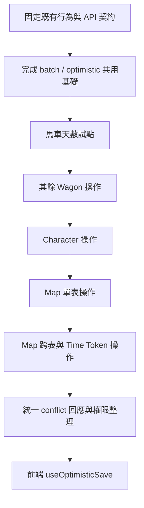

# 後端共用函式重構與測試計畫

## 1. 目標

將馬車、地圖與角色模組重複的樂觀鎖、D1 batch、活動紀錄與衝突回應集中管理，同時維持既有 API 契約、資料表結構與使用者操作行為。

本計畫只處理可證明語意相同的重複流程，不建立可任意傳入資料表或欄位名稱的萬用 SQL helper。

## 2. 現況評估

### 已有基礎

- `server/db/index.ts` 已有 `runD1Batch`，可將 Drizzle query 與 raw SQL query 轉成原生 D1 prepared statement，避開 Drizzle D1 batch 的 `bind` 執行錯誤。
- `server/db/optimistic.ts` 已有 `toD1PreparedStatement`、`executeOptimisticBatch` 及三種 guarded log builder。
- `test/d1_batch.test.ts` 已覆蓋問題重現及 `runD1Batch` 的 statement 轉換。
- Wagon、Map、Character 已有版本欄位與 409 衝突回應。

### 目前問題

1. `optimistic.ts` 尚未被業務模組實際使用，各模組仍自行組裝 batch 與判斷 `meta.changes`。
2. `runD1Batch` 與 `toD1PreparedStatement` 重複 Drizzle query 編譯邏輯。
3. `buildWagonGuardedLog` 目前檢查 `campaigns.version`，但馬車寫入實際以 `campaign_wagons.version` 作為樂觀鎖，必須先修正。
4. Character 把資料更新與版本遞增拆成兩個 statement；主更新判定、Log 順序與版本責任不夠直觀。
5. Map 保留區域性的 `guardedMapLog`、`guardedWagonLog` 與 `runMapBatch`，和共用 helper 重疊。
6. Wagon 多個 handler 重複解析版本、建立 Log、更新版本、檢查結果及回傳 conflict。
7. conflict payload 結構相似，但最新資料的載入方式不同，適合共用型別及回應組裝器，不適合合併 loader。
8. 戰役凍結已有全域 middleware，部分 handler 又重複檢查，需確認唯一責任位置後再整理。

## 3. 設計原則

- 原生 D1 batch 負責交易；Drizzle 負責型別安全的 query 組裝。
- guarded log 排在版本更新前，並使用與主更新相同的版本守衛。
- 檢查指定的主更新 statement，不依賴「最後一筆結果」。
- 表名與欄位名不得由一般字串參數動態插入 SQL。
- Wagon、Map、Character 保留具名 builder。
- helper 回傳結構化的 `updated` 或 `conflict`；D1 例外不吞掉。
- 重構期間不改 API URL、成功 payload、錯誤 code、HTTP status 或 schema。

## 4. 建議結構

### `server/db/batch.ts`

- 保留唯一一份 `toD1PreparedStatement`。
- 提供一般用途的 `runD1Batch`。
- 不包含領域規則。

### `server/db/optimistic.ts`

- `executeOptimisticBatch`
- `buildWagonGuardedLog`
- `buildMapGuardedLog`
- `buildCharacterGuardedLog`
- 共用 JSON 序列化規則與結果型別。

建議介面：

```ts
interface OptimisticBatchOptions {
  beforeUpdate?: readonly BatchItem<'sqlite'>[];
  update: BatchItem<'sqlite'>;
  afterUpdate?: readonly BatchItem<'sqlite'>[];
}

type OptimisticBatchResult =
  | { status: 'updated'; results: D1Result[] }
  | { status: 'conflict'; results: D1Result[] };
```

### `server/http/conflict.ts`

- 定義 Wagon、Map、Character conflict payload 的共用型別。
- 提供回應組裝函式。
- 各模組仍負責載入自己的最新資料。

暫不抽離一般輸入驗證；各領域的範圍與錯誤語意不同，過早合併會產生大量 callback。

## 5. 實作階段

### 階段 A：穩定共用基礎

- [x] 集中 query 轉換邏輯，移除兩份重複實作（抽取至 `server/db/batch.ts`）。
- [x] 修正 Wagon guarded log，守衛 `campaign_wagons.campaign_id` 與 `campaign_wagons.version`。
- [x] 確認 Map、Character builder 包含完整識別鍵。
- [x] 集中 before／after JSON 序列化，定義 `undefined`、`null` 的處理（`safeJsonStringify`）。
- [x] 讓 executor 回傳結構化結果，以指定 update 的 `meta.changes` 判定衝突（`OptimisticBatchResult`）。

### 階段 B：逐模組導入

1. [ ] Wagon：先替換天數、金錢、備註等單一資料列更新。
2. [ ] Wagon：再替換工坊與資源等明細加 Wagon 版本的操作。
3. [ ] Character：統一資料更新與版本遞增責任，改用共用 character log。
4. [ ] Map：以共用 executor 取代 `runMapBatch`。
5. [ ] Map：處理完成卡片時跨 Map／Wagon Log 與 Time Token 的複合 batch。
6. [ ] 移除各模組已無用途的區域 helper 與重複註解。

### 階段 C：衝突回應與權限整理

- [ ] 統一版本參數驗證與 conflict payload 型別。
- [ ] 各模組保留 latest loader，透過共用 responder 回傳 409。
- [ ] 確認所有 mutation route 受全域凍結保護後，再移除 handler 重複檢查。
- [ ] 維持前端重新載入／保留修改流程相容。

### 階段 D：後續候選

- [ ] 活動 Log JSON 解析與後台顯示格式。
- [ ] 分頁、搜尋正規化與 LIKE escaping。
- [ ] API JSON body 解析與一致錯誤格式。
- [ ] 前端 `useOptimisticSave`，統一 dirty、saving、saved、conflict、error。
- [ ] 離開未儲存表單的確認流程。

## 6. 測試計畫

### 單元測試

擴充 `test/d1_batch.test.ts`，並新增 `test/db/optimistic.test.ts`：

- [ ] raw query 與 Drizzle query builder 都能轉成 prepared statement。
- [ ] 所有值均透過 `.bind()`，不直接拼接使用者資料。
- [ ] statement 順序為 `beforeUpdate → update → afterUpdate`。
- [ ] beforeUpdate 為 0、1、多筆時都能定位正確 update 結果。
- [ ] update `changes = 1` 回傳 `updated`。
- [ ] update `changes = 0` 回傳 `conflict`，不受其他結果影響。
- [ ] D1 batch 拋錯時 helper 不吞例外。
- [ ] Wagon builder 守衛 `campaign_wagons`。
- [ ] Map builder 守衛 `campaign_maps`。
- [ ] Character builder守衛 campaign、player 與 version。
- [ ] before／after JSON 正確處理 object、array、null。

### Hono → 本機 D1 整合測試

必須使用 migrations 建立的本機 D1，不用 mock 取代資料庫行為：

- [ ] 正確版本更新成功，版本只增加一次，只新增一筆 Log。
- [ ] 過期版本回傳 409，主資料、明細與 Log 均不改變。
- [ ] 缺少或錯誤版本維持既有錯誤 code。
- [ ] 兩個請求帶相同版本時只有一個成功，另一個收到 latest payload。
- [ ] 凍結戰役的 mutation 均被拒絕且不寫 Log。
- [ ] Wagon 天數、金錢、備註、工坊、資源均有成功及衝突案例。
- [ ] Character 覆蓋成功、衝突及更新其他玩家角色。
- [ ] Map 覆蓋翻牌、位置、放置、完成與移除卡片。
- [ ] 完成卡片並移除 Time Token 時，Map、Token、卡片與兩類 Log 同批成功或同批不變。

### API 契約回歸

- [ ] 比對重構前後成功 JSON。
- [ ] 比對 400、403、404、409 的 code 與 payload。
- [ ] 未知 `/api` 路徑仍回 JSON，不落入 SPA HTML。

### 前端功能測試

- [ ] 儲存中、已儲存、尚未儲存狀態正常。
- [ ] 衝突顯示修改範圍並可重新載入。
- [ ] 保留自己的內容重新套用後可再次儲存。
- [ ] 手機固定操作列與衝突提示不遮住內容。

### 每階段驗證指令

```bash
npm test
npm run typecheck
npm run build
npm run db:check
git diff --check
```

資料一致性變更另跑本機 Hono → D1 整合測試；只有視覺或互動變更才跑 `npm run test:visual`。

## 7. 完成條件

- Wagon、Map、Character 不再複製 batch 轉換與主更新判定。
- 三個模組的版本更新使用同一 executor。
- 過期版本不產生 Ghost Log，也不留下部分更新。
- API 契約與前端操作保持相容。
- 單元、Hono → D1 整合、型別、建置及 schema 檢查全部通過。
- 文件清楚記錄 helper 的使用邊界。

## 8. 建議切分

1. 共用 batch／optimistic helper 與單元測試。
2. Wagon 導入與 Wagon 整合測試。
3. Character、Map 導入及跨領域 Time Token 測試。
4. 衝突回應、權限整理與前端儲存 hook。

不要在同一變更中重構備份匯入、管理後台與圖鑑查詢；它們的交易與錯誤語意不同，應另行規劃。


## 9. 後續標準執行流程

後續不再以「整個檔案全面轉成 ORM」作為工作單位，而以一個可完整驗證的使用者操作作為單位，例如「更新馬車天數」。每個操作都必須完成基準、重構及回歸驗證後，才進入下一個操作。

### 步驟 1：控制遷移範圍

在 Wagon、Character、Map 的資料一致性基礎穩定前，不同時重構備份、管理後台、圖鑑或其他模組。不得在共用 helper 重構中順便修改 API 契約、前端畫面或資料庫 schema。

### 步驟 2：建立重構前行為基準

每個寫入操作在修改前先固定以下行為：

- 請求 payload 與必要欄位。
- 成功回應的 status、JSON 與版本。
- 實際變更的資料表及欄位。
- 版本應增加幾次。
- Log 應增加幾筆及其 before／after 內容。
- 過期版本的 409 payload。
- 衝突、驗證失敗與戰役凍結時必須保持不變的資料。

基準測試描述對外行為，不綁定 ORM 產生的 SQL 字串細節；只有 guarded SQL 與參數綁定等安全條件需要檢查 SQL 結構。

### 步驟 3：先完成共用基礎

在導入任何業務模組前先完成階段 A：

1. 集中 D1 prepared statement 轉換。
2. 修正三種 guarded log 的守衛表與識別鍵。
3. 固定 `beforeUpdate → update → afterUpdate` 順序。
4. 由指定 update statement 的 `meta.changes` 判定結果。
5. 補齊 optimistic helper 單元測試。

這一步只證明共用工具正確，不改 Wagon、Character 或 Map 的 API 行為。

### 步驟 4：以馬車天數作為第一個試點

「更新馬車天數」是第一個導入案例：

```text
讀取 Wagon
→ 建立 guarded Log
→ 更新 elapsedDays 與 version
→ 判定 updated 或 conflict
→ 回傳既有 API payload
```

試點必須通過成功、過期版本、並發、凍結戰役及 Ghost Log 測試。試點穩定後，才依序遷移團隊金錢、馬車備註、工坊與資源。

### 步驟 5：每次只遷移一個操作

每個操作都使用相同循環：

```text
新增或確認基準測試
→ 改用共用 helper
→ 跑單元測試
→ 跑 Hono → 本機 D1 整合測試
→ 比對 API 契約
→ 檢查 Git diff
→ 確認完成條件
```

一個操作未完成時，不同時遷移下一個操作。

### 步驟 6：處理 Character

Wagon 穩定後再處理 Character，重點驗證：

- 可由目前登入玩家更新其他玩家角色。
- 一次儲存只增加一次版本。
- 同一畫面連續儲存不需重新整理。
- 相同版本的並發請求只有一個成功。
- 衝突不寫入 Ghost Log。
- conflict payload 包含目前版本與最新角色資料。
- 角色數值與面板亮點維持一致。

### 步驟 7：最後處理 Map

Map 跨表操作最多，依下列順序遷移：

1. 翻轉地圖卡與地點卡。
2. 更新卡片與事件備註。
3. 更新獵人位置。
4. 放置或移動劇情／任務卡。
5. 完成或重新開啟卡片。
6. 移除卡片。
7. 完成卡片並移除 Time Token。

最後一項必須證明 Map、卡片狀態、Time Token、Map Log 與 Wagon Log 一起成功或一起保持不變。

### 步驟 8：保留可回退的變更邊界

每一批變更只處理同一類問題，並在進入下一批前檢查 diff。建議的 commit 邊界與訊息如下；實際 commit 仍須依專案規則先列出檔案與訊息並取得使用者明確核准：

- `refactor: centralize D1 batch preparation`
- `refactor: unify wagon optimistic updates`
- `refactor: unify character optimistic updates`
- `refactor: unify map optimistic updates`
- `test: add D1 optimistic concurrency integration coverage`

### 步驟 9：每批變更的完成門檻

每一批必須同時符合：

- 該操作的基準測試與新增測試通過。
- 正確版本與過期版本都經過實際 D1 驗證。
- 資料版本只增加預期次數。
- 成功時 Log 正確，衝突時沒有 Ghost Log。
- API 契約沒有非預期變更。
- 型別檢查、建置、Drizzle schema 檢查及 diff 檢查通過。
- 沒有把不相關模組一起納入修改。

### 步驟 10：ORM 與原生 SQL 的使用邊界

本專案不以「完全移除原生 SQL」為目標。預設使用 Drizzle schema 與 query builder；下列 D1／SQLite 特殊操作可保留集中管理、參數化且有測試的原生 SQL：

- `INSERT ... SELECT ... WHERE EXISTS` guarded log。
- 複雜條件式寫入。
- D1 原生 batch。
- 備份批次匯入。
- `last_insert_rowid()`。
- SQLite 特定函式或運算。

判斷原則是資料一致性與可測試性優先，不為了 ORM 覆蓋率改寫已清楚、安全且必要的 SQL。

## 10. 執行順序總覽


