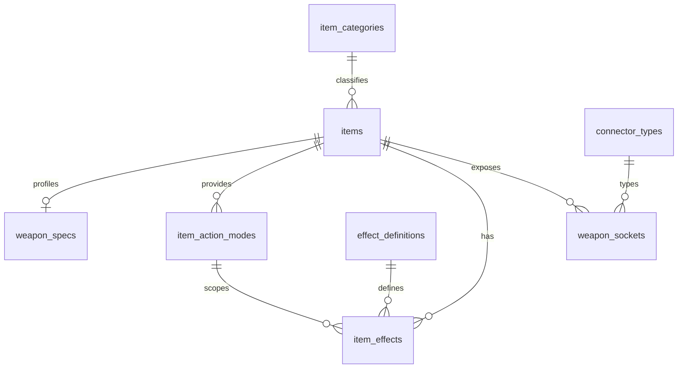

# 資料庫設計

狀態：**已採用並完成 migrations；目前由 `equipment_page1.json` 匯入 12 件武器。**

資料表將物品共同欄位、各類型面板、行動模式與效果分開，避免在 `items` 堆積大量只適用於單一物品類型的空欄位。完整欄位及限制以 `migrations/` 為準。

## 核心資料

| 資料表 | 用途 |
| --- | --- |
| `items` | 名稱、slug、分類、格數、圖片、來源及發布狀態 |
| `item_categories` | 武器、防具、消耗品等固定分類 |
| `item_action_modes` | 攻擊類型、屬性、骰數、修正與距離 |
| `effect_definitions` | 可重用的效果字典 |
| `item_effects` | 物品效果、數值、時機、持續時間及對應行動模式 |

## 物品類型資料

| 資料表 | 用途 |
| --- | --- |
| `weapon_specs` | 武器的一對一規格 |
| `weapon_sockets` | 武器各格的附件接口 |
| `weapon_traits` | 裝填等武器特性 |
| `attachment_specs` | 武器附件可使用的接口 |
| `defense_specs` | 護甲、頭盔與飾品的固定防禦值 |
| `shield_roll_rules` | 盾牌使用的屬性與骰數規則 |
| `connector_types` | 近戰、符文、弓與槍械接口字典 |

## 已保留但尚未開放

`crafting_stations`、`recipes` 與 `recipe_ingredients` 已存在 schema 中，供後續合成功能使用。目前 API 和介面不查詢配方，也沒有匯入合成資料。

## 關聯摘要

## 完整性與來源

- SQL 查詢使用 prepared statement 與 `.bind()`。
- `code` 和 `slug` 全域唯一。
- 發布資料必須有圖片、原始效果文字與來源說明。
- 行動模式限制合法的數值來源、屬性及距離組合。
- 效果只能引用同一物品的行動模式。
- 武器接口不能超出物品格數。
- 圖片保存在靜態資源，D1 只保存 URL。

目前物品的 `source_kind` 是 `reference`，來源註明為使用者整理資料，不宣稱是官方中文規則。

## Migration 順序

1. `0001`：分類、接口與物品主檔
2. `0002`：物品面板、行動模式與接口
3. `0003`：效果字典與物品效果
4. `0004`：合成 schema
5. `0005`：查詢索引
6. `0006`：固定字典
7. `0007`：來源、牌號與發布欄位
8. `0008`：跨欄位及跨表完整性限制

新增 schema 變更時應建立下一份 migration，不修改已套用的 migration。
