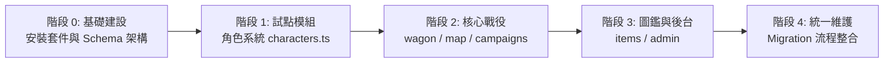

# Drizzle ORM 漸進式遷移計畫 (Cloudflare D1)

## 1. 背景與動機

目前專案後端採用原生 Hono + Cloudflare D1 Raw SQL 查詢 (`c.env.DB.prepare(...).bind(...)`)。

### 面臨的痛點
1. **手工欄位映射繁瑣**：資料庫採蛇形命名 (`snake_case`)，API/前端採駝峰命名 (`camelCase`)，導致如 `server/characters.ts` 必須針對十幾個欄位逐一手動做型別轉換（例如 `Number(row.player_number)`、`Number(row.is_poisoned) === 1`）。
2. **欄位變動成本高**：未來若新增或刪除欄位，需要同時修改 Migration、SELECT 欄位清單、手動 mapping 程式碼、UPDATE 語法與 TypeScript 介面，容易遺漏或產生型別不一致。
3. **無編譯期 SQL 型別檢查**：純文字 SQL 語法錯誤或打錯欄位名稱無法在靜態檢查階段被捕捉。

### 為什麼選擇 Drizzle ORM？
- **Cloudflare 官方首選**：Drizzle 提供 `@drizzle-orm/d1` 原生配接器，直接對接 `c.env.DB`，零額外連線開銷與零冷啟動負擔。
- **純 TypeScript Query Builder**：無笨重 Rust binary（相較於 Prisma），產生的 Worker bundle 極小。
- **型別與駝峰自動對齊**：Schema 一次定義，自動處理 `snake_case` ↔ `camelCase` 與 SQLite 的布林值 (`mode: 'boolean'`) 轉換。
- **共存性極高**：Drizzle 只是一個薄包裝，能與既有 Raw SQL 完全和平共存，非常適合進行**模組化漸進式遷移**。

---

## 2. 遷移總覽架構

---

## 3. 分階段執行規劃

### 階段 0：基礎建設與套件安裝（環境就緒）
- [ ] 執行相依套件安全性檢查與安裝：
  - `drizzle-orm` (運行時依賴)
  - `drizzle-kit` (開發期依賴，用於型別生成與 Schema 管理)
- [ ] 建立資料庫模組目錄結構：
  - `server/db/index.ts`：建立取得 Drizzle 實例的工廠函式 `getDb(db: D1Database)`。
  - `server/db/schema/`：放置各領域的 Schema 檔案。
- [ ] 驗證目前專案 build 與型別檢查無受影響。

### 階段 1：首個試點模組 —— 角色系統 (`characters.ts`)
- [ ] **定義 Schema**：建立 `server/db/schema/characters.ts`。
  - 映射 `campaign_characters` 資料表，宣告所有欄位、主鍵與型別轉換（`isPoisoned` 使用 `{ mode: 'boolean' }`）。
- [ ] **改寫角色讀取**：
  - 以 `db.select().from(campaignCharacters)...` 取代 `loadCharacters` 內的手工 SQL 與手動 mapping。
- [ ] **改寫角色更新**：
  - 角色屬性點擊變更、狀態切換改用 Drizzle 的型別安全 `update(...)`。
  - 維持原本的版本衝突（409 Optimistic Concurrency Control）邏輯。
- [ ] **驗證**：
  - 確保前端 API 回傳 JSON 資料結構 100% 保持一致，前端完全無需修改。
  - 驗證屬性變更、連線同步、版本號衝突行為正常。

### 階段 2：核心戰役模組（馬車、地圖、戰役）
- [ ] **定義戰役與馬車 Schema**：
  - `server/db/schema/campaigns.ts` (`campaigns`, `campaign_sessions`)
  - `server/db/schema/wagon.ts` (`campaign_wagon`, `campaign_wagon_upgrades`, `campaign_wagon_resources`, `campaign_wagon_notes`)
  - `server/db/schema/map.ts` (`campaign_map_cards`, `campaign_map_routes`, `campaign_map_logs`)
- [ ] **改寫 `server/wagon.ts`**：
  - 簡化動態 SQL 更新，替換手工 mapping。
- [ ] **改寫 `server/map.ts`**：
  - 改用 Drizzle 處理地圖牌卡與航行標記。
- [ ] **改寫 `server/campaigns.ts`**：
  - 戰役建立、加入、取得狀態。
- [ ] **驗證**：
  - 執行多玩家連線測試、地圖航行與馬車資源修改驗證。

### 階段 3：圖鑑與後台系統（物品圖鑑、管理者後台）
- [ ] **定義圖鑑與管理 Schema**：
  - `server/db/schema/items.ts` (`items`, `item_sources`, `item_keywords` 等)
  - `server/db/schema/admin.ts` (`admin_users`, `admin_audit_logs`)
- [ ] **改寫 `server/items.ts`**：
  - 簡化篩選查詢（關鍵字、類別、分頁）。
- [ ] **改寫 `server/admin.ts` 與備份還原**：
  - 管理者驗證、審計日誌與快照匯入/匯出。
- [ ] **驗證**：
  - 驗證圖鑑篩選效能、管理者登入與備份還原完整性。

### 階段 4：整理與收尾（Migration 流程標準化）
- [ ] 設定 `drizzle.config.ts`（支援 Cloudflare D1）。
- [ ] 整合或說明手寫 SQL migration 與 Drizzle kit 的協同規範。
- [ ] 更新 `AGENTS.md` 與 `README.md`，說明架構變更與新開發流程。
- [ ] 執行全系統型別檢查、測試與 Cloudflare Workers 部署驗證。

---

## 4. 關鍵原則與風險控制

1. **對外契約不變**：每一階段重構僅限於後端資料存取層，前端 API 回傳的 JSON 契約（包含錯誤代碼與 409 conflict payload）必須保持完全一致。
2. **隨時可部署**：不採用一次性全翻的大爆炸式重構；每個階段完成後皆可獨立執行測試、提交 commit 並部署至 Cloudflare。
3. **保留既有資料庫**：不異動現存遠端 Cloudflare D1 資料庫結構，純粹轉換程式碼的存取介面。
